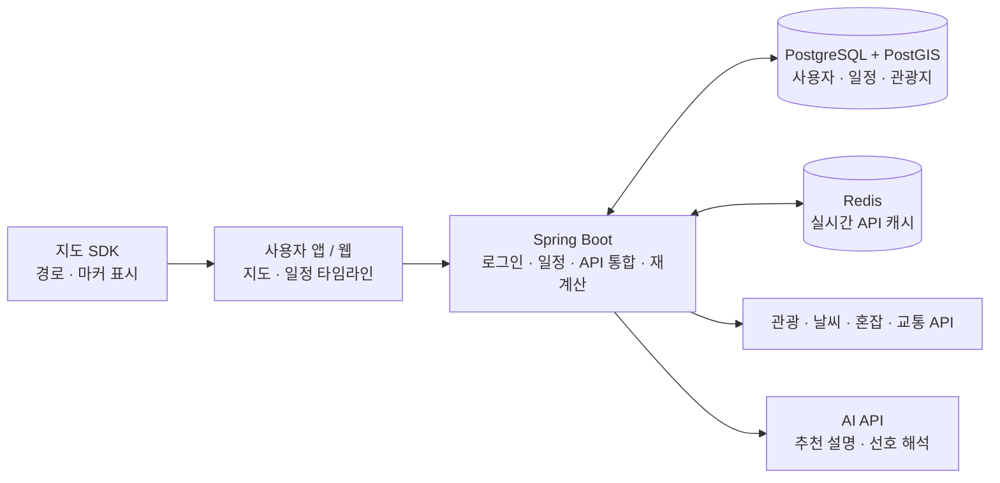
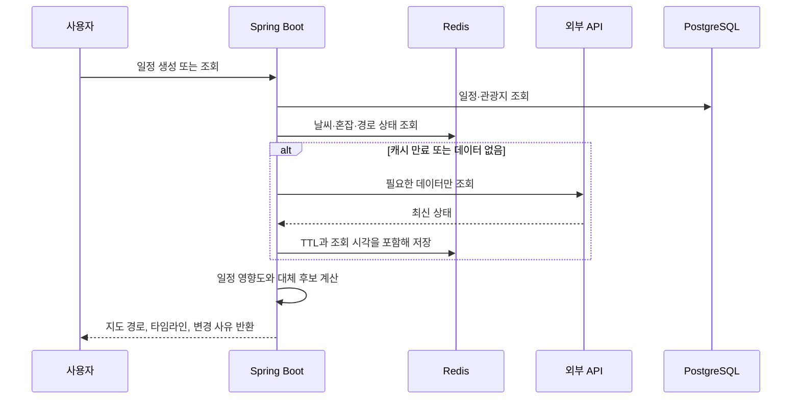

# Gayadi Server

여행 중 발생하는 날씨, 혼잡도, 교통 상황 변화에 맞춰 사용자의 일정을 다시 제안하는 서비스의 서버 설계 문서입니다.

이 문서는 **초기 MVP 구조**를 설명합니다. 처음부터 여러 마이크로서비스를 운영하지 않고, 하나의 Spring Boot 애플리케이션으로 핵심 기능을 검증한 뒤 필요한 지점에서만 확장합니다.

## 서비스가 해결하는 문제

- 비·폭염·기상특보 등으로 실외 일정이 어려워지는 경우
- 관광지 혼잡도 상승으로 방문 경험이 나빠지는 경우
- 교통 정체 또는 대중교통 지연으로 동선이 꼬이는 경우

서버는 실시간 데이터를 일정과 비교하고, 영향이 있을 때만 대체 장소·방문 순서·경로 변경안을 생성합니다. 자동으로 일정을 확정하지 않고, 사용자에게 변경 사유와 예상 시간 차이를 보여준 뒤 선택하게 합니다.

## MVP 아키텍처

### 구성 요소

| 구성 | 책임 | MVP에서 필요한 이유 |
| --- | --- | --- |
| 사용자 앱/웹 | 지도, 일정 타임라인, 변경 제안 표시 | 사용자가 변경안을 이해하고 수락할 수 있는 화면 |
| 지도 SDK | 장소 마커, 방문 순서, 경로 polyline 표시 | Three.js 없이도 지도 기반 경험 구현 가능 |
| Spring Boot | 인증, 일정 관리, 외부 API 통합, 일정 재계산 | 서비스의 단일 진입점과 핵심 비즈니스 로직 |
| PostgreSQL + PostGIS | 사용자, 일정, 관광지 좌표·거리 데이터 | 관계형 일정 데이터와 위치 기반 조회의 원본 저장소 |
| Redis | 날씨·혼잡·경로 API 응답 캐시 | 외부 API 비용·쿼터를 보호하고 응답 속도 개선 |
| 외부 API | 관광지, 날씨, 혼잡도, 교통·경로 데이터 | 실제 상황 변화를 감지하는 입력 데이터 |
| AI API | 자연어 요청 해석, 대체안 설명 | 계산 결과를 사용자가 이해할 수 있도록 보조 |

## 요청과 일정 변경 흐름

실시간 데이터 수집은 Spring Scheduler로 시작합니다. 예를 들어 서울 혼잡도는 5분 주기로 갱신하고, 사용자 요청이 올 때 Redis에서 우선 읽습니다. 같은 장소를 여러 사용자가 조회해도 외부 API 호출이 중복되지 않도록 합니다.

## 일정 재계산 원칙

AI는 모든 결정을 내리는 엔진이 아닙니다. 실제 일정 변경은 검증 가능한 규칙과 경로 계산 결과를 기반으로 수행합니다.

1. 날씨·특보·혼잡도·교통 데이터를 수집합니다.
2. 현재 일정에 미치는 영향을 판정합니다.
3. TourAPI 등에서 대체 후보를 찾습니다.
4. 경로 API로 이동시간을 다시 계산합니다.
5. 기존안과 대체안을 비교합니다.
6. AI는 변경 이유를 자연어로 설명합니다.
7. 사용자가 변경안을 수락하면 일정에 반영합니다.

예: `경복궁은 강수 확률과 혼잡도가 높아 국립현대미술관으로 대체합니다. 총 이동시간은 12분 감소합니다.`

## 캐시 정책

캐시는 원본 데이터가 아니라 외부 API 호출을 줄이기 위한 보조 계층입니다. 일정·사용자 데이터의 원본은 항상 PostgreSQL입니다.

| 데이터 | 저장소 | 기본 정책 |
| --- | --- | --- |
| 관광지 기본정보 | PostgreSQL + Redis | 배치 동기화, 하루 이상 캐시 |
| 날씨 예보 | Redis | 다음 발표 시각 전까지 캐시 |
| 기상특보 | Redis | 1~5분 캐시, 만료 시 우선 재조회 |
| 실시간 혼잡도 | Redis | 제공처 갱신 주기에 맞춰 약 5분 캐시 |
| 경로·예상 이동시간 | Redis | 출발·도착·교통수단·출발 시각별 1~3분 캐시 |

경로 캐시 키에는 출발지, 도착지, 경유지, 이동수단, 출발 시각 구간을 포함합니다. 캐시가 만료되는 순간 여러 요청이 한꺼번에 외부 API를 호출하지 않도록 분산 락과 요청 제한을 적용합니다.

## 다중 사용자와 보안

- 로그인 사용자를 식별하고, 모든 일정 조회·수정에서 소유자 또는 공유 권한을 확인합니다.
- 외부 API 키와 DB 비밀번호는 환경 변수 또는 Secret Manager에만 저장합니다. 브라우저·모바일 앱에 서버용 키를 노출하지 않습니다.
- PostgreSQL과 Redis는 인터넷에 공개하지 않고, 서버에서만 접근합니다.
- HTTPS, 입력값 검증, API별 timeout·rate limit·circuit breaker를 기본 적용합니다.
- 사용자 위치는 명시적 동의를 받은 경우에만 사용하며, 목적에 필요한 기간보다 길게 보관하지 않습니다.
- AI에는 API 키, DB 접속 정보, 다른 사용자의 일정 정보를 전달하지 않습니다. AI 응답은 구조화된 형식으로 검증한 뒤 사용합니다.

## MVP 범위와 확장 기준

MVP에는 Spring Boot, PostgreSQL/PostGIS, Redis, 지도 SDK, 관광·날씨·혼잡·경로 API만 포함합니다.

다음 구성은 실제 필요가 확인된 뒤 추가합니다.

| 확장 요소 | 추가 시점 |
| --- | --- |
| 별도 Worker | 외부 데이터 수집·재계산 작업이 API 서버 부하를 만들 때 |
| OpenSearch | 한국어 장소 검색·자동완성·복잡한 필터가 DB 검색의 병목이 될 때 |
| 이벤트 큐 | 실시간 변경 이벤트와 알림량이 크게 늘어날 때 |
| WebSocket/SSE | 사용자가 보고 있는 일정에 변경안을 즉시 반영해야 할 때 |
| Three.js | 단순 지도 기능을 넘어 3D 관광·실내 길안내·게임형 연출이 필요할 때 |

초기 목표는 복잡한 플랫폼이 아니라, **실시간 여행 변수로 인해 일정이 어긋났을 때 사용자가 납득 가능한 대안을 지도 위에서 받는 경험**을 만드는 것입니다.
