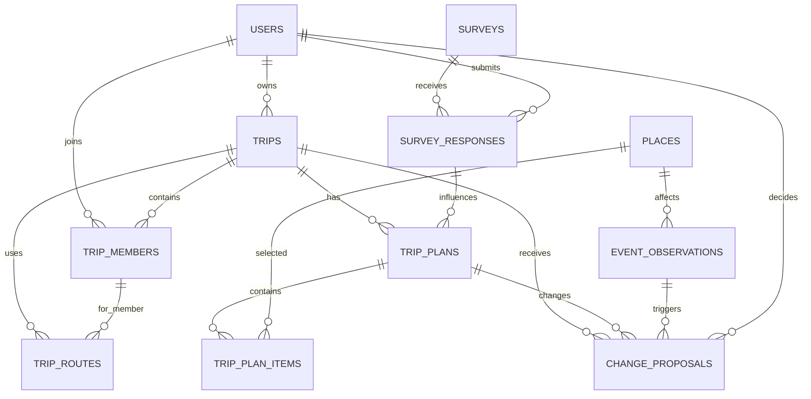
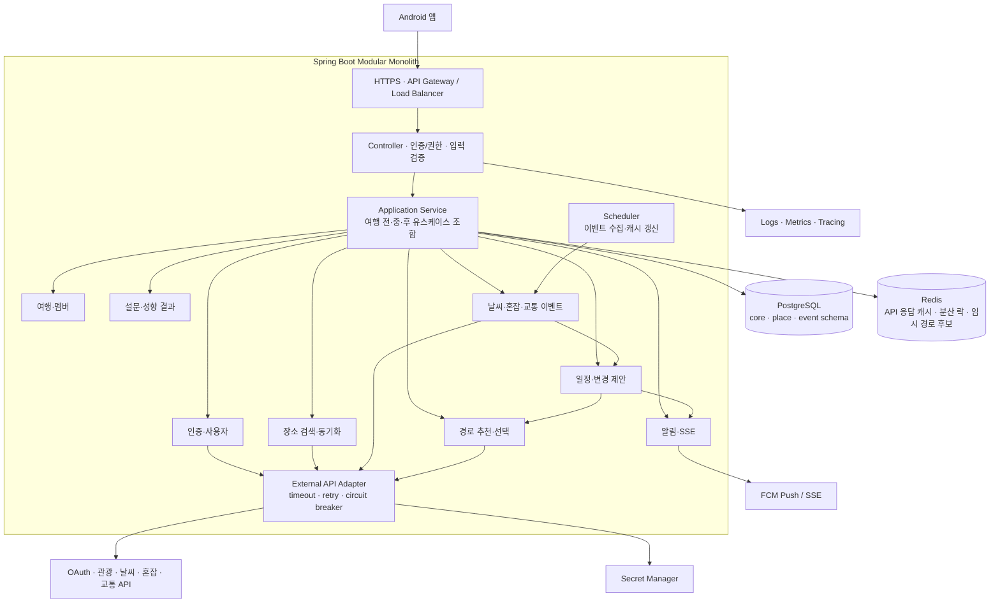
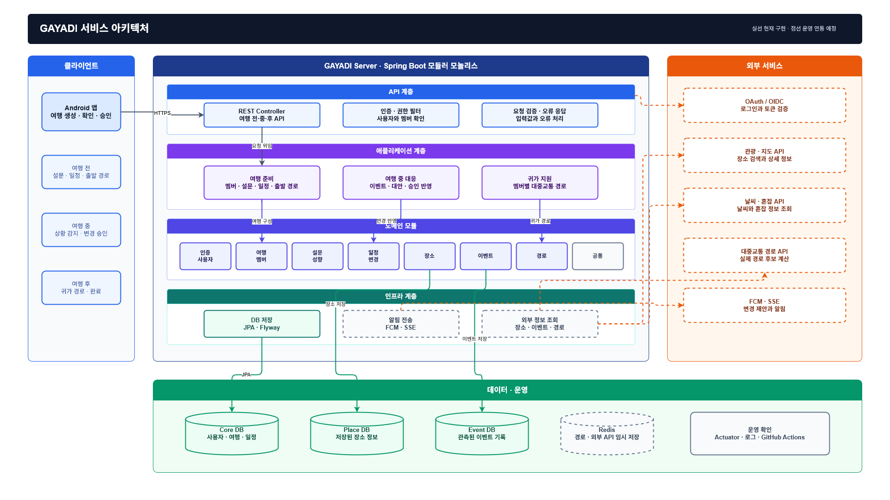
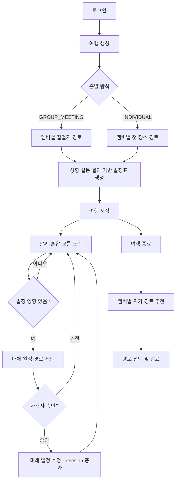

# GAYADI 서비스 설계서

| 항목 | 내용 |
| --- | --- |
| 문서 상태 | MVP 출시 기준 |
| 대상 | Android, Backend, Infra 개발자 |
| 기준일 | 2026-07-19 |
| 공식 ERD | [`docs/database/gayadi-erdcloud.sql`](../database/gayadi-erdcloud.sql) |

이 문서는 GAYADI 서버의 제품 흐름, 데이터 모델, API, 운영 기준을 정의하는 기준 문서다. 구현 중 설계가 변경되면 코드와 함께 이 문서를 수정한다.

### 현재 구현 기준

- Spring Boot 4.1 / Java 21 / Maven Wrapper
- 로컬 기본 실행은 H2, 운영 프로필은 PostgreSQL
- Flyway가 아래 11개 테이블과 기준 장소·설문 데이터를 생성
- 관광·날씨·혼잡·대중교통 API가 없어도 로컬 스텁으로 핵심 흐름 실행 가능
- OAuth/OIDC, Redis, FCM/SSE 및 실제 외부 공급자 어댑터는 다음 연동 단계

## 1. 서비스 개요

GAYADI는 여행자의 성향과 현재 여행 상황을 반영해 여행 전·중·후의 코스와 이동 방법을 추천하는 서비스다.

- 여행 전: 성향 기반 코스 생성
- 출발 전: 모여서 출발 또는 각자 출발에 맞는 대중교통 추천
- 여행 중: 날씨·혼잡도·교통 변화를 확인하고 대체 코스 제안
- 여행 후: 멤버별 집까지 귀가 경로 추천

서버는 일정을 자동 변경하지 않는다. 변경 이유와 대체안을 보여주고, 사용자가 승인했을 때만 새 일정으로 바꾼다.

### 1.1 목표

- 여행 성향을 코스 생성에 반영한다.
- 모여서 출발과 각자 출발 모두에 적합한 대중교통 경로를 제공한다.
- 날씨·혼잡·교통 변화가 실제 일정에 영향을 줄 때만 변경안을 만든다.
- 사용자가 변경 전·후 차이와 이유를 확인하고 직접 결정하게 한다.

### 1.2 MVP 제외 범위

- 항공·숙박·식당의 실제 예약 및 결제
- 사용자의 동의 없는 실시간 위치 추적
- AI가 단독으로 일정 변경을 결정하는 기능
- 초기 단계의 마이크로서비스·이벤트 큐·OpenSearch 운영

## 2. 먼저 알아둘 핵심 개념

| 개념 | 의미 |
| --- | --- |
| `trip` | 제주도 3일 여행 같은 여행 자체 |
| `trip_plan` | 그 여행의 일정표 |
| `trip_plan_item` | 일정표 안의 개별 장소와 시간 |
| `survey` | 성향 테스트처럼 문항이 정의된 일반 설문 |
| `survey_response` | 사용자의 설문 답변과 계산 결과 |
| `place` | 성산일출봉, 카페 같은 장소 정보 |
| `event_observation` | 특정 시점의 비, 혼잡도, 교통 상태 |
| `trip_route` | 여러 후보 중 사용자가 선택한 실제 이동 경로 |

`trip_plan`은 여행당 하나만 둔다. 비가 와서 사용자가 변경안을 승인하면 미래의 `trip_plan_item`만 수정하고 `revision_no`를 증가시킨다. 변경 전·후 내용은 `change_proposal`에 남긴다.

## 3. 여행 흐름

### 여행 전

1. 로그인
2. 여행 생성
3. `GROUP_MEETING` 또는 `INDIVIDUAL` 선택
4. 멤버별 출발지·귀가 목적지 등록
5. 성향 설문 응답과 결과 저장
6. 장소를 기반으로 일정표 생성
7. 출발/집결지 경로 후보 생성 후 선택

### 여행 중

1. 현재 일정 조회
2. Event DB에서 날씨·혼잡·교통 상태 조회
3. 일정에 영향이 있으면 `change_proposal` 생성
4. 대체 장소와 경로를 사용자에게 제안
5. 승인 시 미래 일정 항목 수정 및 `trip_plan.revision_no` 증가

### 여행 후

1. 마지막 일정 종료
2. 멤버별 귀가 목적지 확인
3. `RETURN` 경로 후보 생성
4. 경로 선택 후 여행 완료

### 3.1 주요 상태

| 대상 | 상태 |
| --- | --- |
| 여행 | `DRAFT` → `READY` → `IN_PROGRESS` → `RETURNING` → `COMPLETED` |
| 일정 | `ACTIVE` |
| 일정 항목 | `PLANNED` → `IN_PROGRESS` → `COMPLETED` / `SKIPPED` |
| 변경 제안 | `PENDING` → `APPROVED` / `REJECTED` / `EXPIRED` |

취소된 여행은 `CANCELLED`로 전환한다. 완료된 일정 항목은 날씨나 혼잡 이벤트가 발생해도 수정하지 않는다.

## 4. DB 분리 기준

| 영역 | 테이블 | 역할 |
| --- | --- | --- |
| Core | `users`, `trips`, `trip_members`, `surveys`, `survey_responses`, `trip_plans`, `trip_plan_items`, `trip_routes`, `change_proposals` | 여행 서비스의 업무 원본 |
| Place | `places` | 장소 검색·좌표·외부 장소 ID |
| Event | `event_observations` | 날씨·혼잡도·교통 관측값 |

처음에는 한 PostgreSQL 안에서 schema를 나눠도 된다. 나중에 DB를 분리할 때도 `place_id`, `event_id`를 논리 키로 사용하고 직접 조인하지 않는다.

외부 API 호출 성공/실패, 응답 시간, 오류 코드는 별도 운영 로그로 남긴다. 업무 ERD에는 넣지 않는다.

## 5. DB 스키마와 주요 칼럼

### 5.1 사용자·여행

| 테이블 | 주요 칼럼 |
| --- | --- |
| `users` | `id`, `nickname`, `oauth_provider`, `oauth_subject`, `status` |
| `trips` | `id`, `owner_id`, `title`, `departure_mode`, `departure_at`, `meeting_at`, `meeting_location`, `status` |
| `trip_members` | `id`, `trip_id`, `user_id`, `role`, `participation_status`, `departure_location`, `return_destination`, `route_preferences` |

`trips.departure_mode`는 여행 전체의 출발 방식이다.

- `GROUP_MEETING`: 멤버별 출발지→집결지, 집결지→첫 장소
- `INDIVIDUAL`: 멤버별 출발지→첫 장소

### 5.2 설문·일정

| 테이블 | 주요 칼럼 |
| --- | --- |
| `surveys` | `id`, `survey_type`, `version`, `questions`, `status` |
| `survey_responses` | `id`, `survey_id`, `user_id`, `trip_id`, `answers`, `result_code`, `result_data`, `created_at` |
| `trip_plans` | `id`, `trip_id`, `survey_response_id`, `revision_no`, `status`, `preference_snapshot`, `created_at`, `updated_at` |
| `trip_plan_items` | `id`, `plan_id`, `place_id`, `sequence_no`, `planned_start`, `planned_end`, `status` |

성향 테스트는 `surveys.survey_type = PERSONALITY`인 일반 설문이다. 문항은 `questions` JSON, 사용자의 답변은 `answers` JSON, 계산된 성향과 추천 선호는 `result_code`, `result_data`에 저장한다. 만족도 조사 같은 다른 설문도 같은 구조를 재사용할 수 있다.

### 5.3 장소·이벤트

| 테이블 | 주요 칼럼 |
| --- | --- |
| `places` | `id`, `name`, `category`, `address`, `latitude`, `longitude`, `source`, `source_place_id`, `basic_info` |
| `event_observations` | `id`, `event_type`, `source`, `place_id`, `observed_at`, `valid_to`, `severity`, `normalized_value` |

장소는 반복 검색과 코스 생성에 필요하므로 DB에 저장한다. 날씨·혼잡·교통은 외부 API가 원본이며, 일정 판단에 사용한 관측값만 Event DB에 저장하고 일반 조회는 Redis에 짧게 캐시한다.

### 5.4 경로·변경 제안

| 테이블 | 주요 칼럼 |
| --- | --- |
| `trip_routes` | `id`, `trip_id`, `member_id`, `scope`, `phase`, `origin`, `destination`, `duration_minutes`, `transfer_count`, `fare`, `route_data`, `status`, `valid_until` |
| `change_proposals` | `id`, `trip_id`, `plan_id`, `event_id`, `base_revision_no`, `status`, `reason`, `options`, `selected_option`, `before_snapshot`, `after_snapshot`, `decided_by`, `decided_at` |

경로 API가 반환한 후보는 Redis에 짧게 보관한다. 사용자가 후보를 선택했을 때만 `trip_routes`에 저장하며, 환승 구간은 `route_data` JSON에 넣는다.

### 5.5 일정 변경 정책

- 여행 준비 중에는 사용자가 `trip_plan_items`를 직접 수정할 수 있다.
- 여행 시작 후 자동 감지된 변경은 먼저 `change_proposals`로 제안한다.
- 승인 시 하나의 트랜잭션에서 미래 일정 항목을 수정하고 `revision_no`를 1 증가시킨다.
- 이미 완료된 일정 항목은 수정하지 않는다.
- `base_revision_no`가 현재 계획과 다르면 오래된 제안이므로 `EXPIRED` 처리한다.
- `before_snapshot`과 `after_snapshot`에는 변경된 일정 항목만 저장한다.

## 6. ERD

ERDCloud에 가져올 수 있는 전체 DDL은 [`gayadi-erdcloud.sql`](../database/gayadi-erdcloud.sql)에 있다. 이 파일은 ERD 표현을 위한 MySQL 8 문법이며, 실제 PostgreSQL migration은 구현 단계에서 Flyway로 관리한다.



`PLACES`와 `EVENT_OBSERVATIONS`는 별도 DB로 이동할 수 있으므로, 실제 운영에서는 Core DB와 API로 연결한다.

## 7. 서비스 아키텍처



위 모듈들은 각각 별도 서버가 아니라 하나의 Spring Boot 애플리케이션 안에 있는 코드 경계다. Controller가 모듈을 직접 섞어 호출하지 않고, Application Service가 여행 생성·코스 추천·실시간 변경 같은 유스케이스를 조합한다.

### 7.1 모듈 책임

| 모듈 | 책임 |
| --- | --- |
| 인증·사용자 | OAuth 로그인, 사용자 식별, 여행 접근 권한 |
| 여행·멤버 | 여행 상태, 출발 방식, 집결지, 멤버별 출발·귀가 설정 |
| 설문·성향 결과 | 설문 정의, 응답 저장, 결과 코드와 추천 선호 생성 |
| 일정·변경 제안 | 현재 일정 관리, 영향 판정, 변경 제안 승인과 revision 증가 |
| 장소 | 장소 검색, 외부 장소 ID 매핑, 기본 정보 동기화 |
| 이벤트 | 날씨·혼잡·교통 데이터 정규화, 일정 영향 이벤트 생성 |
| 경로 | 외부 경로 API 호출, 후보 캐시, 선택 경로 저장 |
| 알림 | 변경 제안 Push 발송, 앱 실행 중 SSE 전달 |
| External API Adapter | 공급자별 요청/응답 변환, timeout, retry, circuit breaker |

### 7.2 데이터와 백그라운드 처리

- PostgreSQL: 사용자, 여행, 설문 응답, 일정, 장소, 판단에 사용한 이벤트
- Redis: 자주 바뀌는 날씨·혼잡·경로 응답, 아직 선택하지 않은 경로 후보, 분산 락
- Scheduler: 출발이 임박했거나 진행 중인 여행의 장소만 선별해 외부 데이터를 갱신
- 외부 API Adapter: 공급자가 바뀌어도 도메인 모듈이 영향을 적게 받도록 표준 모델로 변환
- Push/SSE: 백그라운드에서는 Push, 앱에서 여행 화면을 보는 동안에는 SSE 사용
- 알림 재시도: `change_proposals.notified_at`이 없는 제안을 다시 발송해 일시적 Push 실패를 복구

### 7.3 MVP와 확장 기준

- MVP: Spring Boot 1개, PostgreSQL 1개, Redis 1개로 시작한다.
- 서버가 여러 대가 되면 Scheduler 중복 실행을 Redis 분산 락으로 막는다.
- 외부 데이터 수집과 일정 재계산이 API 응답을 지연시킬 때 Worker를 분리한다.
- 알림과 변경 이벤트가 크게 늘어날 때 이벤트 큐를 추가한다.
- `core`, `place`, `event` DB는 데이터량과 운영 주기가 실제로 달라질 때 물리적으로 분리한다.

확장형 배치 구조는 아래 이미지를 참고한다. MVP 구성과 혼동하지 않도록 Worker, 이벤트 큐, OpenSearch는 확장 조건이 충족된 뒤 도입한다.



## 8. 서비스 흐름도



## 9. 주요 API

### 9.1 공통 규약

- Base path: `/api/v1`
- 현재 로컬 MVP: `/users`로 개발용 사용자를 만들며, 일부 결정 API에서 여행 멤버 여부를 검증
- 운영 연동 목표: `Authorization: Bearer <access-token>`의 OAuth/OIDC principal을 모든 권한 판단에 사용
- 시간: API는 ISO 8601을 사용한다. 현재 MVP는 `LocalDateTime`, 운영 전환 시 UTC `Instant` 정책으로 통일
- `Idempotency-Key`, cursor 페이지네이션은 운영 연동 단계에서 추가
- 오류 응답: `code`, `message`, `traceId`, `details`를 공통 형식으로 반환

```json
{
  "code": "TRIP_REVISION_CONFLICT",
  "message": "일정이 이미 변경되었습니다. 최신 일정을 다시 확인해 주세요.",
  "traceId": "01J...",
  "details": {}
}
```

| 단계 | API | 연결 모델 |
| --- | --- | --- |
| 여행 생성 | `POST /api/v1/trips` | `trips`, `departure_mode` |
| 여행 조회 | `GET /api/v1/trips/{tripId}` | `trips`, `trip_members` |
| 멤버 설정 | `POST /api/v1/trips/{tripId}/members` | `trip_members` |
| 설문 조회 | `GET /api/v1/surveys/personality` | `surveys` |
| 설문 제출 | `POST /api/v1/trips/{tripId}/survey-responses` | `survey_responses` |
| 그룹 성향 | `GET /api/v1/trips/{tripId}/personality-profile` | `survey_responses` |
| 일정 생성 | `POST /api/v1/trips/{tripId}/plan/generate` | `places`, `trip_plans`, `trip_plan_items` |
| 일정 조회 | `GET /api/v1/trips/{tripId}/plan` | `trip_plans`, `trip_plan_items` |
| 장소 조회 | `GET /api/v1/places/{placeId}` | Place DB + Event DB/Redis |
| 경로 추천 | `POST /api/v1/trips/{tripId}/routes/recommend?phase=...&memberId=...` | `RouteProvider`, `trip_routes` |
| 여행 시작 | `POST /api/v1/trips/{tripId}/start` | `trips.status` |
| 이벤트 관측 | `POST /api/v1/trips/{tripId}/event-observations` | `event_observations`, `change_proposals` |
| 변경안 조회 | `GET /api/v1/trips/{tripId}/change-proposals` | `change_proposals` |
| 변경 승인 | `POST /api/v1/trips/{tripId}/change-proposals/{proposalId}/decision` | 일정 항목 수정, `trip_plans.revision_no` 증가 |
| 여행 완료 | `POST /api/v1/trips/{tripId}/complete` | 귀가 경로 + 여행 상태 |

## 10. 최종 저장 판단

| 데이터 | 처리 방식 | 이유 |
| --- | --- | --- |
| 현재 여행 일정 | `trip_plans`, `trip_plan_items` 직접 수정 | 항상 현재 상태를 쉽게 조회 |
| 일정 변경 이력 | `change_proposals`의 전·후 스냅샷 | 전체 일정 복제 없이 승인 이력 보존 |
| 설문 | 정의와 응답만 분리, 문항·답변은 JSON | 여러 설문에 재사용하면서 과도한 분리 방지 |
| 장소 | Place DB 저장 | 검색·좌표·코스 생성에 반복 사용 |
| 날씨·혼잡·교통 | 일반 조회는 Redis, 판단에 사용한 이벤트만 DB | 외부 API 데이터의 불필요한 중복 방지 |
| 경로 후보 | Redis 단기 캐시 | 시각에 따라 금방 오래된 데이터가 됨 |
| 선택한 경로 | `trip_routes` 저장 | 여행 진행과 귀가 안내에 다시 사용 |
| 외부 API 호출 내역 | 운영 로그 | 업무 ERD와 분리 |

## 11. 외부 API와 캐시 정책

| 데이터 | 원본 | 저장/캐시 정책 | 장애 시 동작 |
| --- | --- | --- | --- |
| 장소 기본 정보 | 관광/지도 API | Place DB 저장, 24시간 이상 캐시 | 마지막 동기화 데이터 제공 |
| 날씨 예보 | 날씨 API | 발표 시각 기준 Redis TTL | 마지막 정상 데이터와 갱신 시각 표시 |
| 기상특보 | 날씨 API | 1~5분 Redis TTL | 기존 일정 유지, 데이터 지연 안내 |
| 혼잡도 | 혼잡 API | 제공처 갱신 주기 기준 약 5분 TTL | 혼잡도 미확인으로 표시 |
| 경로 후보 | 교통/지도 API | 요청 조건별 1~3분 캐시 | 기존 선택 경로 유지, 재계산 실패 안내 |
| 선택 경로 | GAYADI | `trip_routes`에 스냅샷 저장 | 외부 API 장애 중에도 조회 가능 |

외부 API Adapter는 공급자별 응답을 내부 표준 모델로 변환한다. timeout, 제한된 retry, circuit breaker, rate limit을 공통 적용하며, 외부 응답 원문은 기본적으로 영구 저장하지 않는다.

## 12. 보안과 개인정보

- OAuth/OIDC 로그인 후 짧은 수명의 access token을 사용한다.
- 여행 조회·수정 시 항상 소유자 또는 멤버 권한을 검사한다.
- 집 주소와 출발 위치는 암호화하고, 다른 멤버에게 정확한 좌표를 노출하지 않는다.
- 실시간 위치는 여행별 동의가 있을 때만 Redis에 저장하고 여행 종료 후 삭제한다.
- PostgreSQL과 Redis는 private network에서만 접근한다.
- API 키, OAuth secret, DB 비밀번호는 Secret Manager로 관리한다.
- 로그에는 토큰, API 키, 정확한 주소, 전체 외부 API 원문을 남기지 않는다.
- 위치정보 수집 목적·보관 기간·철회 방법을 앱에서 명시한다.

초기 보관 기준:

| 데이터 | 보관 기준 |
| --- | --- |
| 임시 위치 | 여행 종료 시 삭제, 최대 24시간 |
| 일반 날씨·혼잡 조회 | Redis TTL 종료 시 삭제 |
| 변경 근거 이벤트 | 변경 제안 감사 기간 동안 보관 |
| 외부 API 운영 로그 | 기본 30일, 개인정보 마스킹 |
| 사용자 여행·일정 | 사용자 삭제 요청 또는 서비스 정책에 따름 |

## 13. 안정성과 관측성

### 13.1 초기 운영 목표

| 항목 | 목표 |
| --- | --- |
| API 가용성 | 월 99.5% 이상 |
| 내부 캐시 조회 | p95 500ms 이하 |
| 외부 경로 추천 | p95 5초 이하 |
| 변경 제안 전달 | 이벤트 감지 후 1분 이내 |

외부 공급자 지연 시간은 별도 지표로 분리한다. 목표를 벗어나도 현재 확정 일정과 선택 경로는 항상 조회할 수 있어야 한다.

### 13.2 필수 지표와 알림

- API 요청 수, p50/p95/p99 지연 시간, 4xx/5xx 비율
- 외부 API별 성공률, 지연 시간, timeout, circuit breaker 상태
- Redis cache hit ratio와 분산 락 실패
- Scheduler 처리 시간과 미처리 여행 수
- 변경 제안 생성 수, 승인률, 만료율
- Push 발송 성공률과 SSE 연결 수
- DB connection pool, slow query, 저장 공간

모든 요청에는 `traceId`를 부여하고 구조화 로그·메트릭·트레이싱에서 동일한 ID를 사용한다.

## 14. 배포와 검증

### 14.1 환경과 배포

- `dev`, `staging`, `production` 환경을 분리한다.
- CI에서 문서 링크, 빌드, 단위 테스트, 통합 테스트를 수행한다.
- DB 변경은 Flyway migration으로만 적용하고 실행 순서를 버전 관리한다.
- 배포 전 DB 백업과 migration 호환성을 확인한다.
- `/actuator/health/liveness`, `/actuator/health/readiness`를 제공한다.
- 실패한 배포는 이전 애플리케이션 이미지로 롤백하되, 이미 실행된 DB migration은 전진 수정한다.
- 운영 DB는 자동 백업과 point-in-time recovery를 활성화하고 정기적으로 복구 절차를 검증한다.

### 14.2 테스트 범위

- 단위 테스트: 출발 방식, 일정 영향도, revision 충돌, 변경 승인 규칙
- 통합 테스트: PostgreSQL, Redis, 권한 검사, 트랜잭션 처리
- 계약 테스트: 관광·날씨·혼잡·교통 API Adapter의 표준 응답 변환
- E2E 테스트: 여행 생성 → 설문 → 일정 생성 → 경로 선택 → 변경 승인 → 귀가
- 장애 테스트: 외부 API timeout, Redis 장애, 중복 Scheduler, 오래된 변경 제안

## 15. 출시 단계와 결정 필요 항목

### 15.1 출시 단계

1. 여행·멤버·설문·장소·일정 생성
2. 모여서/각자 출발 경로와 귀가 경로
3. 날씨·혼잡·교통 이벤트 수집
4. 변경 제안·승인·Push/SSE
5. 운영 지표 확인 후 Worker·이벤트 큐·DB 분리 검토

### 15.2 출시 전 확정할 항목

- OAuth, 관광, 날씨, 혼잡, 교통/경로 API 공급자
- 날씨·혼잡·교통을 변경 제안으로 전환하는 임계값
- 정확한 위치정보 보관·파기 정책과 약관 문구
- 변경 제안 승인 권한: 방장만 승인 또는 멤버 투표
- Push와 SSE의 재전송·중복 수신 정책
- 운영 환경의 최종 SLO와 알림 임계값
